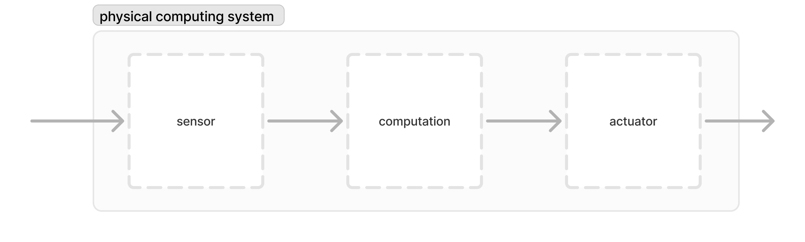
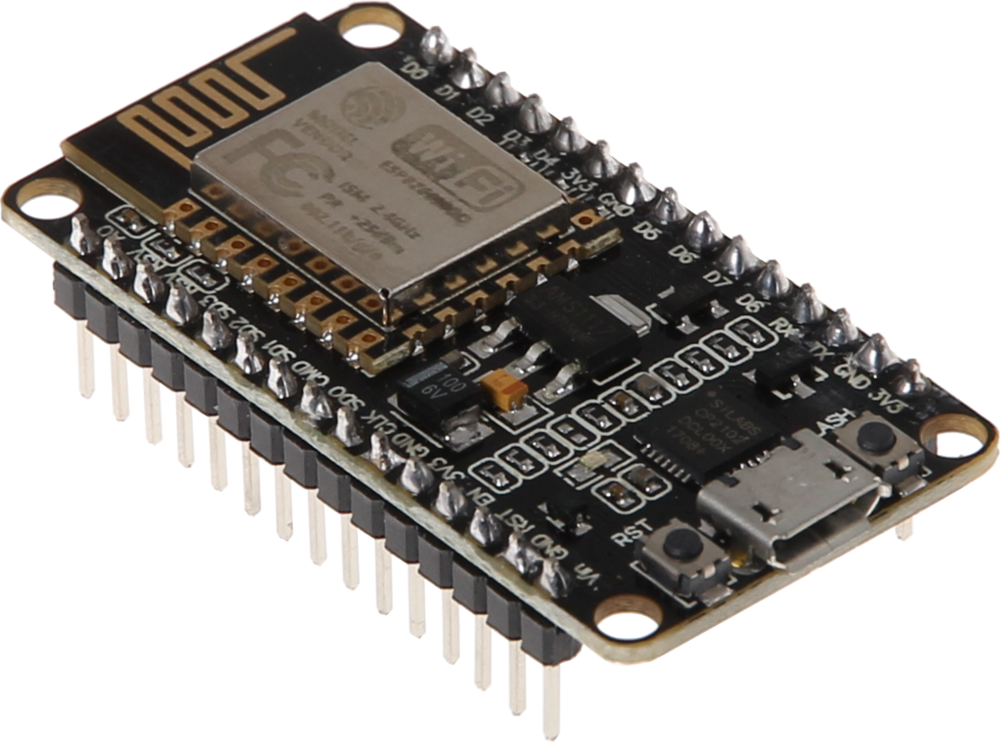
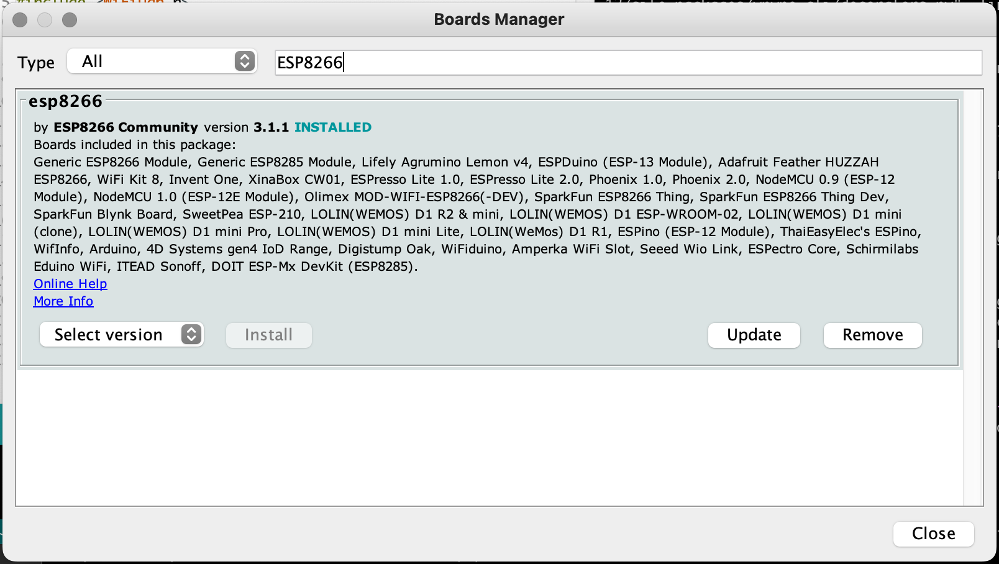
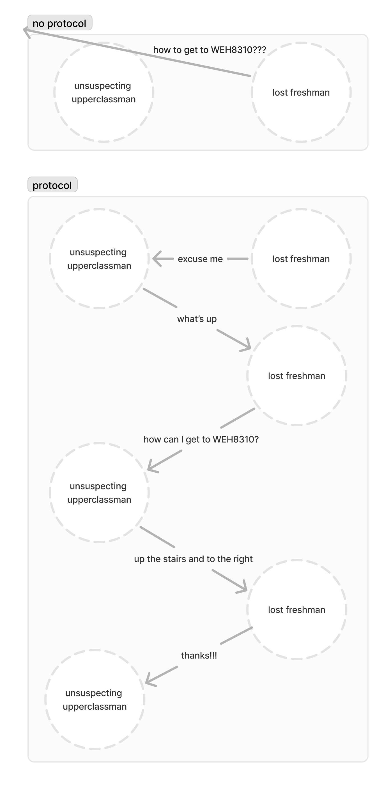
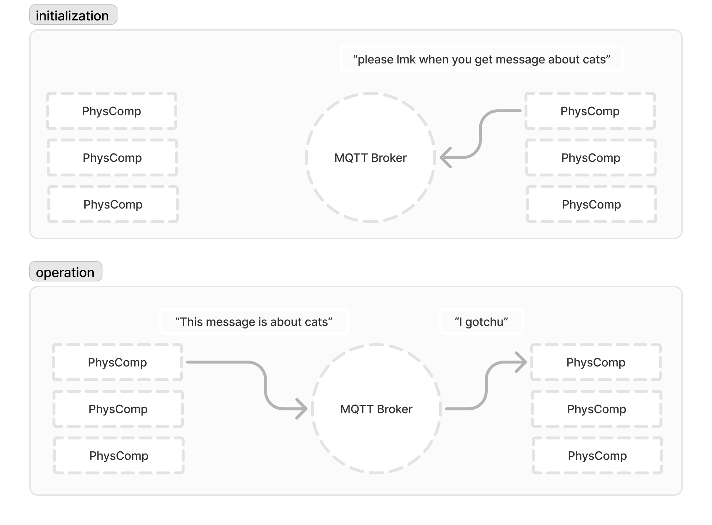

# Intro to IoT

## In This Repo
Starter code in `starter` directory \
Complete code for reference in `src` \

## Lets Review
What does IoT stand for? \
What does that actually mean? \
How does IoT differ from treditional physical computing? \

## IoT is a Network of Physical Computing Systems
 \


## What We're Building Today: yonolin++
We're gonna build a collaborative music making platform, where each team sends sensor data to a music-making system, which will interprite that data and convert it into music. The system might then send data back to the smart device, where it can use it to control another actuator.

You will each need an ESP8266 and a sensor, plus some wires, resistors, and maybe an LED or two.

You will also need the Arduino IDE installed (preferably version <2.0), and [Python](https://www.python.org/downloads/). You can download the Arduino IDE from the [official Arduino website](https://www.arduino.cc/en/software). 

## The ESP8266



The ESP8266 is a low-cost Wi-Fi microchip with full TCP/IP stack and microcontroller capability. It is widely used in IoT projects due to its versatility and ease of use. The chip allows microcontrollers to connect to a Wi-Fi network and make simple TCP/IP connections using Hayes-style commands. With its powerful onboard processing and storage capabilities, the ESP8266 can be integrated with sensors and other application-specific devices through its GPIOs, making it an ideal choice for IoT applications.

## Setup

Sending code the the ESP is *slightly* more complicated then sending to a standard arduino, but here are the steps for setting up your IDE to work with the ESP8266:
1. Open the Arduino IDE *from the terminal*
    - getting weird already... the ESP8266 compiler uses python for some reason, and the Arduino IDE has a hard time finding python if its opened from the GUI. You'll have to find out where Arduino.app is installed, and run `open path/to/Arduino.app` in your terminal.
2. Install the ESP8266 library
    - Navigate to the IDE's settings page (ctrl / cmd + , or from the toolbar)
    - Under 'Aditional Boards Manager URLs', paste this link: https://github.com/esp8266/Arduino/releases/download/3.1.1/package_esp8266com_index.json
    - Hit 'ok'
    - Go to `Tools>Board>Board Manager`
    - Search for 'ESP8266'
    - Locate the package and hit install. *This tutorial was made with v3.1.1 (1/31/25)*
    
    - You've succesfully installed the ESP8266 package!
3. Install some other packages
    - Check out the `#include` statments at the top of the provided code. Those are libraries that we're importing into our sketch, so you're gonna need to install them. To install a package:
    - Go to `Sketch>Include Library>Manage Libraries...`
    - Search for the package
    - Hit install

## Overview of the Project
Here's what we need our smart devices to be able to do:
1. Connect to the internet
2. Connect to a network where we can send and receive data
3. Generate data to send
4. Send the data
5. Look out for incomming data
6. Do something with the incoming data

## Lets Get Coding

### Connecting to the Internet
This part isn't all that hard, so all of the code is provided in the starter. You'll just have to fill in the name and password of the WiFi network you're using

### Connect to a network where we can send a receive data

Stop and think about this step. There are no physical wires between our devices anymore, meaning it's rather difficult to send messages to a specific device and look out for messages from specific devices... What to do... What to do...

### Protocols to the Rescue!



### MQTT
The protocol we're gonna be using is MQTT

MQTT (Message Queuing Telemetry Transport) is a lightweight messaging protocol designed for small sensors and mobile devices optimized for high-latency or unreliable networks. It operates on a publish-subscribe model, which decouples the message sender (publisher) from the receiver (subscriber). 



In this model, devices (clients) can publish messages to a central broker on specific topics. Other devices can subscribe to these topics to receive messages. The broker is responsible for distributing the messages to the appropriate subscribers. This model is highly efficient for IoT applications as it reduces the complexity of direct device-to-device communication and allows for scalable and flexible message distribution.

#### Connecting to the MQTT Server 

We first have to establish a connection to the MQTT server. We do this by repeatedly calling 
```cpp
mqtt_client.connect(mqtt_client_id.c_str(), MQTT_USER, MQTT_PASSWORD)
```
Until a connection has been established. the `mqtt_client_id` variable must be unique and configured on the MQTT server ahead of time. We will be using a [cedalo](https://platform.cedalo.cloud) server for this.

#### Subscribing
Once a connection has been made, we can subscribe to a topic via
```cpp
mqtt_client.subscribe(MQTT_TOPIC_IN);
```
where `MQTT_TOPIC_IN` is the topic you want to listen for.


#### Publishing
Finally, we can publish data via
```cpp
mqtt_client.publish(MQTT_TOPIC_OUT, data_string.c_str());
```
where `MQTT_TOPIC_OUT` is the topic assigned to our data, and `data_string` is our data. Note that this data should be a string in this case. 

*a note on C++:*
Unlike other languages, you can't just throw ints into a function that expects a string and hope for the best. To convert an int to a string, you can do the following:
```
int data = analogRead(A0); // read an integer
String data_string = String(data); // convert it into a string data structure
Serial.println(data_string.c_str()); // convert the data structure into a string primitive
```

#### Callbacks
Now that we're subscribing and publishing, we can add callback functions so we can do something with the data we send / receive. 
```cpp
mqtt_client.setCallback(callback);
```
will execute the function `callback` each time a message comes in from the broker. Now if we defined the callback function like so:
```cpp
void callback(char* topic, byte* payload, unsigned int length) {

  Serial.print("Message arrived on topic: '");
  Serial.print(topic);
  Serial.print("' with payload: ");
  for (unsigned int i = 0; i < length; i++) {
    Serial.print((char)payload[i]);
  }
  Serial.println();
}
```

we will print the message topic and payload to the serial monitor.